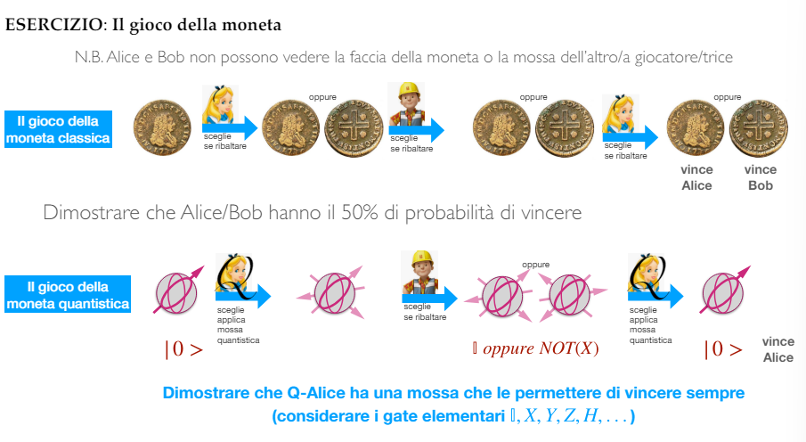
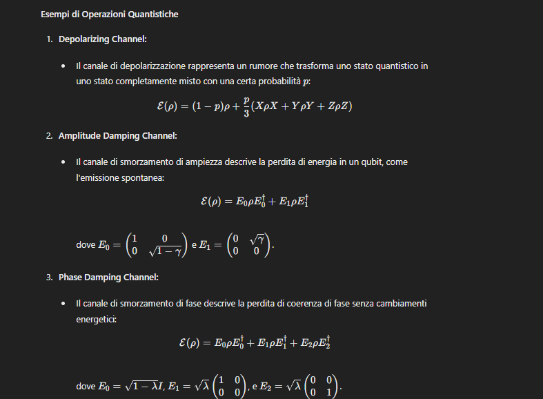
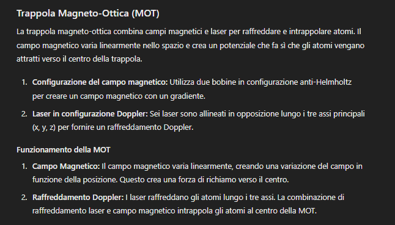

## Domanda Calarco
### Capitolo 1
1. Spiegami cos'è un qubit, una superposizione, la sfera di Bloch. //RISPOSTO
2. Spiegami sistemi di due qubit, entanglement, stati di Bell(misure correlate). //RISPOSTO
3. Spiegami i single qubit gate, i two qubit gate(swap gate), il CNOT.(con esempi di calcolo) //RISPOSTO

4. Circuito di copia quantistica e teorema di non clonazione.(con esempi di calcolo) //RISPOSTO //DA RIVEDERE

5. Spiegami la teleportazione quantistica.(con esempi di calcolo) //RISPOSTO

Prima $X^{M_2}$, poi $Z^{M_1}$.

6. Spiegami il circuito di Toffoli e il teorema di universaltà dei gate di Toffoli. //RISPOSTO
7. Spiegami l'algoritmo di Deutsch-Josza. //RISPOSTO

### Capitolo 2
8. Spiegami le matrici di Pauli, il prodotto interno, il prodotto esterno, la decomposizione spettrale, il prodotto tensoriale, gli operatori Hermitiani. //RISPOSTO
9. Primo postulato della meccanica quantistica, spiegalo. //RISPOSTO
10. Secondo postulato della meccanica quantistica e Secondo' postulato della meccanica quantistica, spiegali. //RISPOSTO
11. Terzo postulato della meccanica quantistica, con stati distinguibili, misure proiettive, POVM, spiegali. //RISPOSTO
12. Spiegami cos'è la fase e il quarto postulato della meccanica quantistica. //RISPOSTO
13. <u>Protoccolo Error Correction e BB84, spiegali.</u>

## Domanda Ercolessi
### Capitolo 1.5
1. Gioco della moneta quantistica, spiegalo. //RISPOSTO

2. Spiegami l'esperimento di Stern-Gerlach. //RISPOSTO

3. Spiegami l'esperimento di Mach-Zehnder. //RISPOSTO

4. Spiegami la fenditura di Young. //RISPOSTO

### Capitolo 2
5. Paradosso EPR e ineguaglianza di Bell, spiegali. //RISPOSTO //DA RIVEDERE

6. Teletrasporto quantistico, spiegalo. //RISPOSTO
7. Stati puri e misti, e matrice densità, spiegali. //RISPOSTO

Per gli stati puri la matrice densità è uguale al prodotto esterno dello stato puro con se stesso, quindi può essere descritta come un operatore proiettore. Deve avere inoltre le seguenti proprietà:
- $P_{\psi}$ è bounded, in particolare $||{P_{\psi}} = 1||$.
- $P_{\psi} = P_{\psi}^{\dagger}$.
- $P_{\psi}$ è positiva, ovvero $\braket{\phi|P_{\psi}|\phi} \geq 0$ per ogni $\phi$.
- $Tr(P_{\psi}) = 1$.
- $P_{\psi}^2 = P_{\psi}$.

Per gli stati misti la matrice densità è una combinazione di stati puri moltiplicati per una probabilità. Deve avere inoltre le seguenti proprietà:
- $\rho$ è bounded
- $\rho = \rho^{\dagger}$
- $\rho$ è positiva
- $Tr(\rho) = 1$
- $\rho^2 \neq \rho$ altrimeti sarebbe uno stato puro.

8. <u>3 quantum channel: depolarizing, amplitude damping, phase damping, spiegali.</u> //RISPOSTO

9. <u>Quantum Operators, quantum operations, spiegali.</u>

## Domande Minardi
### Esperimento 1 - Teletrasporto quantistico
1. Fotoni come qubit, polarizzatori e rivelatori, spiegali.  //RISPOSTO
2. Esperimento di Vienna(1997), Misura di Bell e indistinguibilità dei fotoni, Parametric Down Conversion, spiegalo. //RISPOSTO

5. Phase Matching, onda ordinaria e straordinaria, spiegali. //RISPOSTO

### Esperimento 2 - Esperimenti di Bell
7. Esperimento di Freedman e Clauser(1972), regole di selezione nelle transizioni radioattive, spiegali. //RISPOSTO

8. Esperimento di Aspect 1(1981), spiegalo. //RISPOSTO

9. Esperimento di Aspect 2(1981), spiegalo. //RISPOSTO
10. Esperimento di Aspect 3(1982), spiegalo. //RISPOSTO
11. Loopholes, spiegali. //RISPOSTO

### Esperimento 3 - Criptografia quantistica
12. Esperimento di Ekert(1992) e Esperimento di Naik et al.(2000), spiegalo. //RISPOSTO

14. Quantum Key Distribution da satellite, spiegalo. //RISPOSTO

### <u>Esperimento 4 - Atomi di Rydberg</u>
15. Atomi di Rydberg, livelli energetici, lifetimes, spiegali. //RISPOSTO

16. Pinzette ottiche, spiegali. //RISPOSTO

17. Interazione tra due atomi, blocco di Rydberg, spiegali. //RISPOSTO

18. Qubit, operazioni unitarie, C-Z gate su atomi di Rydberg, spiegali. //RISPOSTO

18. Raffreddamento laser, raffreddamento doppler, trappola magneto ottica, spiegali. //RISPOSTO

## Cose extra
